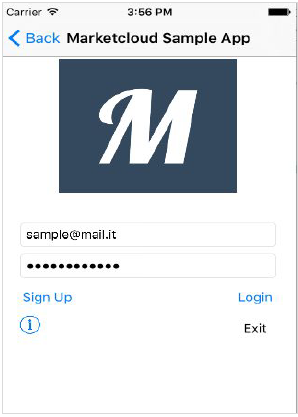
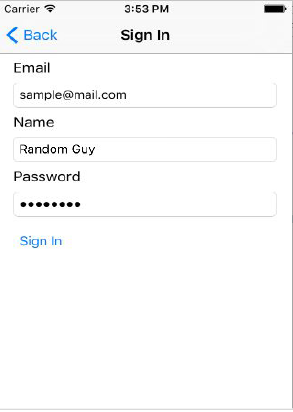
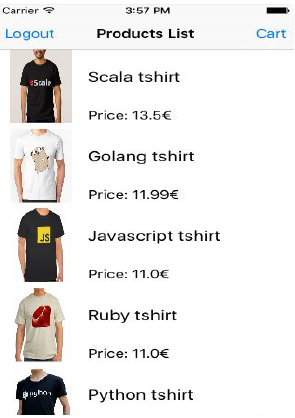
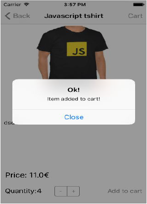
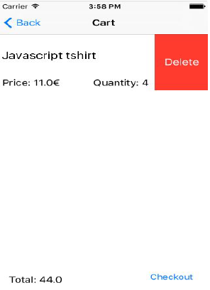
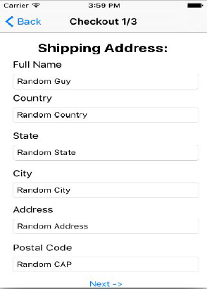
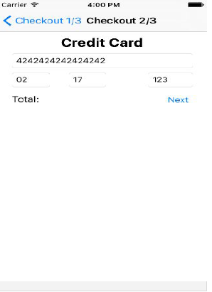
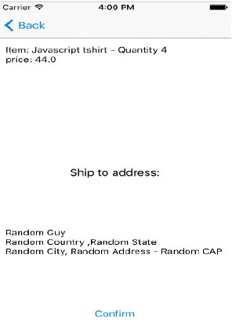
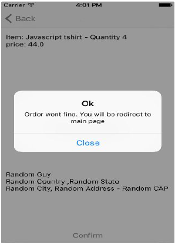

# Marketcloud Sample Swift 2.2 Application

## Sample Swift application that implements the Marketcloud Swift SDK ##

## Implemented features ##

1. Login and Sign in
2. List of available products + search bar
3. Add and remove a product from your cart
4. See details about a product
5. Add a shipping address
6. Stripe SDK implementation for payment
7. Check a recap about your order before the last confirmation
8. Confirm and conclude your order

## Sample screenshots ##

Login View 

Sign In

Products list

Add to cart

Remove from cart (swipe left on a product when in your cart)

Add a shipping address

Credit card informations

Order recap.

Confirm your order

## License ##

1. Swift - Copyright © 2016 Apple Inc. All rights reserved.

2. For the Sample Application:

Copyright 2016 [Marketcloud](http://www.marketcloud.it)

Licensed under the Apache License, Version 2.0 (the "License");
you may not use this file except in compliance with the License.
You may obtain a copy of the License at

    http://www.apache.org/licenses/LICENSE-2.0

Unless required by applicable law or agreed to in writing, software
distributed under the License is distributed on an "AS IS" BASIS,
WITHOUT WARRANTIES OR CONDITIONS OF ANY KIND, either express or implied.
See the License for the specific language governing permissions and
limitations under the License.
